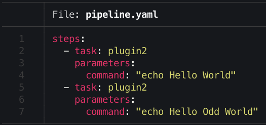

# Tiny Pipeline Engine

Tiny Pipeline Engine (TPE) is a PoC of creating a simple workflow/pipeline engine with dynamically loaded tasks/functions using Go Plugins

## Build

```bash
$> make all
```

## Run

```bash
$> bin/tiny-pipeline-engine
```

## Screenshots




